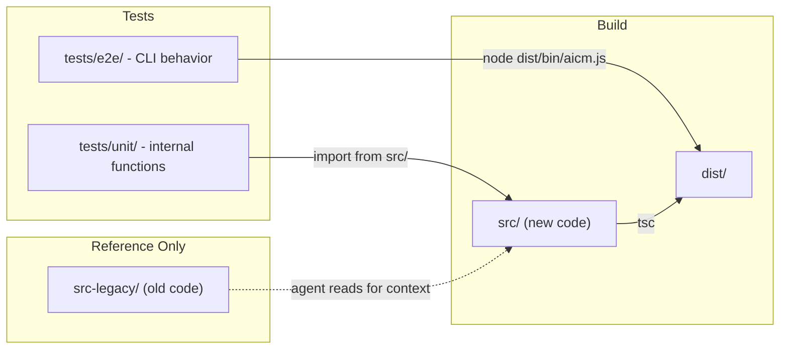

# Clean Slate Source Rewrite via Coding Agent

## Architecture Overview

The e2e tests are decoupled from the source code -- they shell out to the compiled CLI binary at `dist/bin/aicm.js`. This makes a clean rewrite safe: as long as the new code compiles and produces the same CLI behavior, tests pass.

## Test Restructuring

Currently, 4 test files in `tests/e2e/` are actually unit/integration tests that import directly from source. Before the rewrite, restructure them:

**Move to `tests/unit/` (rewritten alongside source):**

- `tests/e2e/install-cache.test.ts` --> `tests/unit/install-cache.test.ts`
  - Pure unit test. Imports 8 functions + 2 types from `src/utils/install-cache`.
  - Tests internal cache mechanics (paths, read/write, validation).
- `tests/e2e/preset-source.test.ts` --> `tests/unit/preset-source.test.ts`
  - Pure unit test. Imports 3 functions from `src/utils/preset-source`.
  - Tests URL parsing logic.
- `tests/e2e/github-integration.test.ts` --> `tests/unit/github-integration.test.ts`
  - Integration test. Imports `shallowClone`/`sparseClone` from `src/utils/git`.
  - Tests git operations against real GitHub.

**Split `tests/e2e/git-preset.test.ts`:**

- The `describe("git clone operations")` block (lines 63-250) tests `shallowClone`/`sparseClone` directly --> move to `tests/unit/git.test.ts` (including the `createBareGitRepo` helper)
- The `describe("full e2e: aicm install with GitHub preset")` block (lines 252-322) uses `runCommand` --> stays in `tests/e2e/git-preset.test.ts`

**Stays as-is:**

- `tests/e2e/api.test.ts` -- tests the public programmatic API (`install()` from `src/api`). This is an e2e test of a public contract. Can be modified during the rewrite if the API shape changes.

**Update [jest.config.js](jest.config.js):**

- Change `testMatch` to include both: `["**/tests/e2e/**/*.test.ts", "**/tests/unit/**/*.test.ts"]`

**Key rule:** Unit tests in `tests/unit/` are co-evolved with source -- the agent rewrites both the source module and its unit test together. E2e tests in `tests/e2e/` are the immutable spec (never modified, except `api.test.ts` if needed).

## Preparation

1. **Copy** `src/` to `src-legacy/` (do NOT move -- keep src intact initially)
2. **Exclude** `src-legacy/` from TypeScript compilation by adding it to `tsconfig.json` exclude array
3. **Restructure tests** as described above (move unit tests, split git-preset, update jest config)
4. Verify `pnpm test` still passes after restructuring (sanity check)
5. **Then** delete all files inside `src/` to start fresh

## Implementation Phases

Each phase ends with a test run. The agent should:

- Read the corresponding file(s) from `src-legacy/` for reference
- Write new, clean implementations in `src/`
- For unit-tested modules: write both `src/` and `tests/unit/` files together
- Run the specified test command after each phase
- Fix any failures before proceeding

### Phase 1: CLI Scaffolding

**Write:** `src/bin/aicm.ts`, `src/cli.ts`, `src/types/declarations.d.ts`

**Reference:** `src-legacy/cli.ts`, `src-legacy/bin/aicm.ts`

Write the CLI entry point and command router with help/version support. Commands can be stubs that throw "not implemented" for now.

**Test:** `pnpm build && pnpm jest -- tests/e2e/cli.test.ts`

### Phase 2: Foundation Utilities

**Write (no tests):** `src/utils/is-ci.ts`, `src/utils/working-directory.ts`

**Write (source + unit test together):**

- `src/utils/preset-source.ts` + `tests/unit/preset-source.test.ts`
- `src/utils/install-cache.ts` + `tests/unit/install-cache.test.ts`

These are leaf modules with no internal dependencies. The agent designs the internal API and writes matching unit tests. Reference `src-legacy/` for behavior, but the function signatures can change.

**Test:** `pnpm build && pnpm jest -- tests/unit/`

### Phase 3: Init Command + Basic Config Loading

**Write:** `src/commands/init.ts`, `src/utils/config.ts` (minimal -- just load `aicm.json` via cosmiconfig)

Only implement enough of config.ts to load the local config file. Preset resolution, workspace detection, etc. come later.

**Test:** `pnpm build && pnpm jest -- tests/e2e/init.test.ts`

### Phase 4: Core Install (Instructions + MCP)

**Write:** `src/utils/instructions.ts`, `src/utils/instructions-file.ts`, `src/commands/install.ts`

Implement instruction loading (frontmatter parsing, inline vs progressive disclosure), instruction file writing (AGENTS.md / CLAUDE.md), and the basic install command (instructions + MCP servers, no presets/skills/agents/hooks/workspaces yet).

**Reference:** Fixtures in [tests/fixtures/](tests/fixtures/) show expected input/output for each scenario.

**Test:** `pnpm build && pnpm jest -- tests/e2e/install.test.ts tests/e2e/instructions.test.ts tests/e2e/mcp-targets.test.ts tests/e2e/ci.test.ts tests/e2e/verbose-error.test.ts`

### Phase 5: List, Clean, API

**Write:** `src/commands/list.ts`, `src/commands/clean.ts`, `src/api.ts`

- `list` -- read config and print instructions
- `clean` -- remove aicm-managed files/dirs
- `api.ts` -- export `install()` and `checkWorkspacesEnabled()` (the latter can stub for now). If the API shape needs to change, update `tests/e2e/api.test.ts` accordingly.

**Test:** `pnpm build && pnpm jest -- tests/e2e/list.test.ts tests/e2e/clean.test.ts tests/e2e/api.test.ts`

### Phase 6: Presets + Git Operations

**Write:** `src/utils/presets.ts`, `src/utils/git.ts`, `src/utils/github.ts`; extend `src/utils/config.ts` with preset resolution

**Write (source + unit test together):**

- `src/utils/git.ts` + `tests/unit/git.test.ts`
- Keep/update `tests/unit/github-integration.test.ts` to match new `git.ts` exports

Implement preset loading (file-based, npm, recursive inheritance, circular detection), target presets (cursor/claude-code shortcuts), and git-based presets (shallow clone, sparse checkout, caching).

**Test:** `pnpm build && pnpm jest -- tests/e2e/presets.test.ts tests/e2e/target-presets.test.ts tests/e2e/git-preset.test.ts tests/unit/git.test.ts tests/unit/github-integration.test.ts`

### Phase 7: Skills + Agents

Extend `src/utils/config.ts` and `src/commands/install.ts` to handle skills and agents (loading from local dirs, copying to target paths, collision detection, multi-target).

**Test:** `pnpm build && pnpm jest -- tests/e2e/skills.test.ts tests/e2e/agents.test.ts`

### Phase 8: Hooks

**Write:** `src/utils/hooks.ts`; extend install command

Implement hook loading, writing to `.cursor/hooks.json` and `.cursor/hooks/aicm/`, user-preserved hooks, collision handling.

**Test:** `pnpm build && pnpm jest -- tests/e2e/hooks.test.ts`

### Phase 9: Workspaces

**Write:** `src/utils/workspace-discovery.ts`, `src/commands/install-workspaces.ts`; extend config.ts and api.ts (`checkWorkspacesEnabled`)

Implement workspace package discovery (npm, Bazel), per-package installation, workspace-level merging of instructions/skills/agents/MCP/hooks.

**Test:** `pnpm build && pnpm jest -- tests/e2e/workspaces.test.ts`

### Phase 10: Full Suite + Cleanup

1. Run the complete test suite: `pnpm test`
2. Fix any remaining failures
3. Delete `src-legacy/`
4. Run `pnpm format`
5. Run `pnpm lint` and fix any issues
6. Run `pnpm knip` to check for unused exports/dependencies
7. Final `pnpm test` to confirm everything passes

## Agent Instructions

At each phase, the coding agent should:

1. **Read** the relevant `src-legacy/` files to understand the current behavior
2. **Read** the corresponding test file(s) to understand what behavior is expected
3. **Read** the relevant fixture directories to understand input/output formats
4. **Write** clean, new implementations -- do NOT copy-paste from legacy
5. **For unit-tested modules:** write both the source and the `tests/unit/` test together, designing a clean internal API
6. **Build and test** using the specified test command
7. **Fix** any failures before proceeding to the next phase
8. **Never modify e2e test files or fixtures** -- they are the spec (exception: `api.test.ts` if the public API shape changes)

Code quality goals for the rewrite -- **focus on simplicity, modularity, and clarity:**

- Write simple, readable code. Prefer straightforward solutions over clever abstractions. Each function should do one thing and be easy to understand in isolation.
- Keep modules small and focused. Split large modules (e.g., the old config.ts was 930+ lines). Each file should have a single, clear responsibility. Use barrel re-exports where needed for convenience.
- Consistent error handling (pick one: throw or return result objects -- not both)
- No direct `console.log` -- use a thin logging utility
- Use `path`/`path.posix` consistently for cross-platform compat
- Follow existing formatting rules ([.prettierrc](.prettierrc))
- Minimize coupling between modules. Pass data explicitly rather than relying on shared mutable state.
